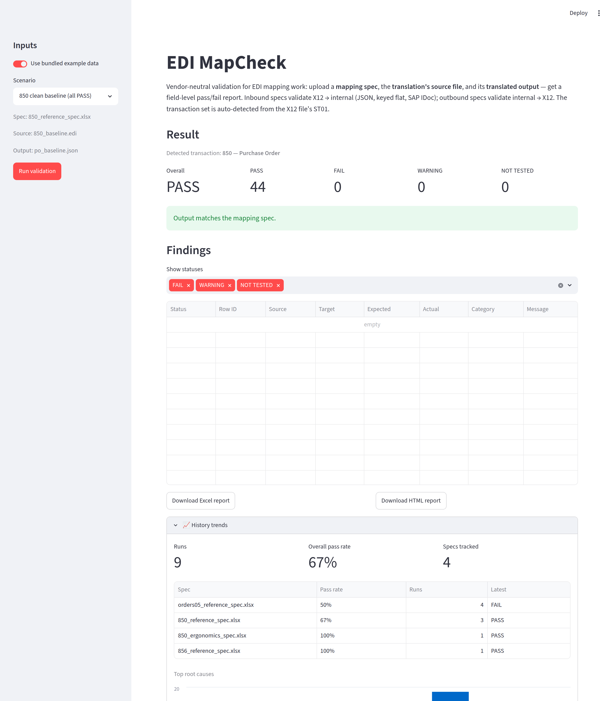
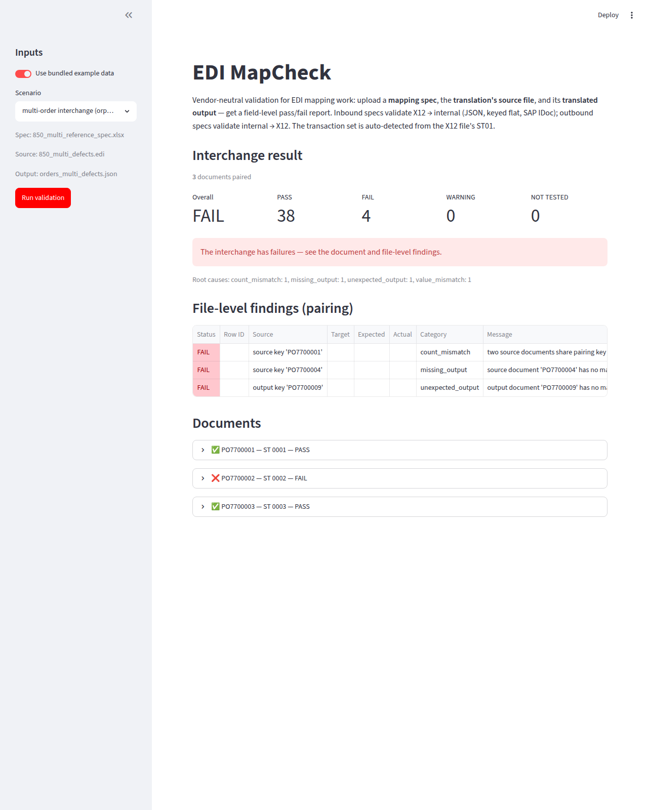
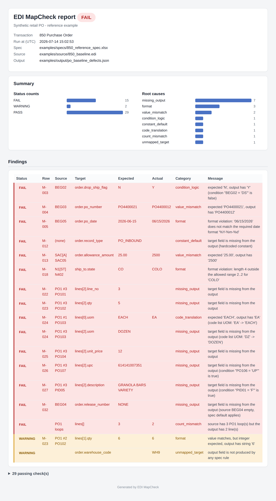

# EDI MapCheck

**Vendor-neutral validation for EDI mapping work.** Give it three artifacts — a
mapping spec, the translation's source file, and its output — and it tells
you, field by field, whether the output actually does what the spec says.
Both directions: inbound (X12 → internal) and outbound (internal → X12).

Transactions are **declarative**: each supported set is a YAML definition file
(segment dictionary, loop hierarchy, reconciliation rules), not parser code.
The transaction is auto-detected from the file's ST01. `mapcheck transactions`
lists what's registered.


## Why

Every EDI integration ships on the back of a mapping spec, and every EDI
specialist has burned days eyeballing a translator's output against that spec
line by line. Middleware vendors each have their own map-testing story, tied to
their own product. There was no small, open, product-agnostic tool that answers
the only question that matters at unit-test time:

> *Does the output file match what the spec says the source file should produce?*

EDI MapCheck answers that with a field-level PASS/FAIL report, a root-cause
summary, and an audit trail.

## What it checks

For every row of the mapping spec, the engine evaluates:

| # | Rule category | Example defect it catches |
|---|---------------|--------------------------|
| 1 | Value accuracy | `BEG03` PO number transposed on its way to `order.po_number` |
| 2 | Conditional logic | drop-ship flag set although `BEG02` ≠ `DS` |
| 3 | Code list translations | `EA` passed through untranslated instead of `EACH` |
| 4 | Hardcoded defaults | the constant `record_type` missing from the output |
| 5 | Data type & format | dates in the wrong format, implied decimals not applied (`2500` ≠ `25.00`), length violations |
| 6 | Loop / repeat counts | a dropped line item; a CTT count the translator trusted but the loops contradict |
| 7 | Unmapped elements | source data no rule references; output fields no rule produces |

Statuses are **PASS / FAIL / WARNING / NOT TESTED**, each failure tagged with a
root cause (`value_mismatch`, `condition_logic`, `code_translation`,
`constant_default`, `format`, `count_mismatch`, `source_data`,
`unmapped_source`, `unmapped_target`, `control`).

On top of the per-rule checks, three document-level layers run on every X12
file, independent of the spec:

- **Envelope reconciliation — strict.** MapCheck natively audits SE01
  segment counts, SE02 ↔ ST02, GE01 transaction counts, GE02 ↔ GS06, IEA01
  group counts, and IEA02 ↔ ISA13. A mismatch is a **failure** (exit code
  1), not a warning, and the message states both sides: `SE01 segment count
  mismatch: SE claims 9 segments but transaction 0001 contains 11 (ST
  through SE)`.
- **Truncation detection.** A file that dies mid-transfer — missing
  SE/GE/IEA trailers, an unterminated final segment — is reported as
  `interchange truncated: ...` naming the last complete segment, never a
  stack trace. Delimiters are read from the ISA's fixed byte positions, not
  assumed. Input that is not X12 at all (non-ASCII bytes, a UTF-8 BOM) is
  rejected with a clean message, and a file that declares a different
  version than the definition (a 5010 file against the 4010 definition) is
  still validated, with the mismatch called out as a warning naming the
  structure it was validated against.
- **Required elements.** Transaction definitions declare base-standard
  mandatory elements (for the 850: BEG03, and PO102 whenever PO103 is
  present, per X12 condition C0302). An empty required element is a
  failure no matter what the mapping spec says — a PO without a PO number
  is defective, full stop.

These checks are exercised end to end by the five-file audit kit under
`tests/fixtures/audit_kit/` (five 850s with documented seeded defects; the
test suite asserts the exact expected finding set for each, including
"no findings" for the clean file). The measured audit record lives in
[docs/audit-gap-list.md](docs/audit-gap-list.md).

## Quickstart

```bash
git clone https://github.com/chapdad031167/EDI-Map-Check.git
cd EDI-Map-Check
pip install -e ".[dev]"

# validate the bundled synthetic example set
mapcheck validate \
  --spec examples/specs/850_reference_spec.xlsx \
  --source examples/source/850_baseline.edi \
  --output examples/output/po_baseline_defects.json \
  --export-xlsx report.xlsx
```

That run points the clean synthetic 850 at an output file with eleven planted
mapping defects, and catches all of them:

```text
STATUS     ROW     FIELD                            DETAIL
FAIL       M-003   order.drop_ship_flag             expected='N' actual='Y' — expected 'N', output has 'Y' (condition "BEG02 = 'DS'" is false)
FAIL       M-004   order.po_number                  expected='PO4400021' actual='PO4400012' — expected 'PO4400021', output has 'PO4400012'
FAIL       M-005   order.po_date                    expected='2026-06-15' actual='06/15/2026' — format violation: '06/15/2026' does not match the required date format '%Y-%m-%d'
FAIL       M-012   order.record_type                expected='PO_INBOUND' actual=None — target field is missing from the output (hardcoded constant)
FAIL       M-013   order.allowance_amount           expected='25.00' actual='2500' — expected '25.00', output has '2500'
FAIL       M-018   ship_to.state                    expected='CO' actual='COLO' — format violation: length 4 outside the allowed range 2..2 for 'COLO'
...
Summary: 29 PASS / 15 FAIL / 2 WARNING / 0 NOT TESTED — RESULT: FAIL
Root causes: missing_output: 7, format: 3, value_mismatch: 2, condition_logic: 1,
             constant_default: 1, code_translation: 1, count_mismatch: 1, unmapped_target: 1
```

Exit code is `0` on PASS, `1` on FAIL — drop it straight into CI.

The transaction set is auto-detected, so any of the 17 supported sets works
the same way. An 856 ASN with a corrupted HL tree, for instance:

```bash
mapcheck validate \
  --spec examples/specs/856_reference_spec.xlsx \
  --source examples/source/856_defects.edi \
  --output examples/output/asn_defects.json
```

```text
FAIL  -  (hierarchy)  hierarchical structure defect: HL at line 26:
         parent id '9' does not reference an earlier hierarchical loop (orphan)
WARNING  recon:ctt02-unit-sum  CTT02=999 != sum(SN102 over HL[I])=96
```

### Streamlit UI

```bash
streamlit run app.py
```

Upload the three files (or flip on the bundled example scenarios), run, filter
by status, download the color-coded Excel report:



### Run it as an app (no terminal)

For non-CLI users, run the whole thing as a web app in a container — one
command, then open a browser. No Python install, no command line:

```bash
docker compose up            # then open http://localhost:8501
```

or with plain Docker:

```bash
docker build -t edi-mapcheck .
docker run --rm -p 8501:8501 edi-mapcheck
```

The image honors `$PORT`, so the same build runs unchanged on any container
host — **Cloud Run, Render, Railway, Fly.io** — and is published to
**GitHub Container Registry** on each release
(`docker run -p 8501:8501 ghcr.io/chapdad031167/edi-map-check:latest`). To put
it online for free, point **[Streamlit Community Cloud](https://streamlit.io/cloud)**
at this repo with `app.py` as the entrypoint — users just get a URL.

### Install the CLI (pipx)

For the command-line tool on its own, without cloning:

```bash
pipx install "git+https://github.com/chapdad031167/EDI-Map-Check.git"
mapcheck --help
```

### Other commands

```bash
mapcheck transactions             # list registered transaction definitions
mapcheck init-spec my_spec.xlsx   # blank spec template with instructions sheet
mapcheck draft-spec --transaction 850 --target orders05 \
    --output draft.xlsx           # definition-driven draft spec (see below)
mapcheck history                  # recent runs from the SQLite audit trail
mapcheck bless 7                  # mark run #7 as the golden baseline for its inputs
mapcheck regress --spec … --source … --output …   # diff vs baseline; exit 1 on a regression
mapcheck batch --junit report.xml # run every check in ./mapcheck.yaml (CI mode)
mapcheck scrub partner.edi        # mask sensitive values, preserving structure
mapcheck report --html trends.html # history trends dashboard (pass-rate per spec)
mapcheck validate --help          # all options (--export-html, --transaction, --db, ...)
```

## Transaction coverage

| Set | Name | Status | Notes |
|-----|------|--------|-------|
| 850 | Purchase Order | ✅ Supported | Reference spec + full synthetic test set |
| 856 | Ship Notice/Manifest (ASN) | ✅ Supported | Full HL hierarchy: standard, pick-and-pack, and palletized structures; orphan/nesting integrity; SN1 rollup reconciliation |
| 855 | Purchase Order Acknowledgment | ✅ Supported | ACK line-status code lists; accept/reject splits reconcile against ordered quantities |
| 810 | Invoice | ✅ Supported | TDS total reconciles against line extensions + charges − allowances (declarative arithmetic) |
| 940 | Warehouse Shipping Order | ✅ Supported | Bare W01 line loops; ship-to / warehouse party loops |
| 945 | Warehouse Shipping Advice | ✅ Supported | LX-wrapped lines; W03 total + undeclared-short-ship reconciliation |
| 943 | Warehouse Stock Transfer Shipment | ✅ Supported | Transfer pair (ship side); W03 total vs line sums |
| 944 | Warehouse Stock Transfer Receipt | ✅ Supported | Transfer pair (receipt side); W14 total vs line sums |
| 947 | Warehouse Inventory Adjustment | ✅ Supported | W19 adjustment-reason code list; signed adjustment quantities |
| 846 | Inventory Inquiry/Advice | ✅ Supported | Multi-qualifier QTY buckets (QA/QO/QC) via path addressing `LIN>QTY[QA]` |
| 812 | Credit/Debit Adjustment | ✅ Supported | Signed amounts; header total reconciles as a signed sum of line amounts |
| 867 | Product Transfer and Resale | ✅ Supported | Pharma trace/rebate flow: PTD lines, resale price, header-total quantity rollup |
| 844 | Product Transfer Account Adjustment | ✅ Supported | Chargeback request: contract number + debit-amount rollup; line-level (WAC − contract) × qty math is backlogged |
| 845 | Price Authorization Acknowledgment | ✅ Supported | Contract pricing; authorization date-window check (`not_after`) |
| 849 | Response to 844 | ✅ Supported | Approval status code list; approved total vs line sum. 844⇄849 pairing is a future cross-transaction feature |
| 854 | Shipment Delivery Discrepancy | ✅ Supported | Discrepancy reason code list |
| 997 | Functional Acknowledgment | ✅ Supported | AK1/AK2/AK9; acknowledgment code lists; AK9 count sanity (accepted ≤ received ≤ included) |

**All 17 roadmap transaction sets are supported.**

Each transaction is a YAML file under `src/mapcheck/transactions/definitions/`
declaring its areas, segment dictionary, loops (including HL-style
parent-child trees), envelope expectations, and declarative reconciliation
rules (e.g. *CTT01 must equal the PO1 loop count*, *CTT02 must equal the sum
of item SN1 quantities*). The parser and engine are generic; adding a set
means adding a definition file, a reference spec, and synthetic test data —
no parser code.

**856 HL addressing:** an item-level spec rule (Loop Context `HL[I]`) reads
its own segments first, then its ancestors' — so `PRF01` resolves from the
item's parent order and `MAN02` from its carton, with no extra spec syntax.
Orphaned HL02 references, unknown level codes, and illegal nesting (an item
directly under a shipment) are structural failures. Assumption noted for the
reference spec: shipment-level TD1 lading quantity reconciles against the
pack-loop count (cartons), while CTT02 covers the unit rollup — TD102 with a
carton packaging code counts cartons, not units.

**Pharma set (844/845/849/854):** public documentation on these is thin, so
the reference definitions use minimal synthetic conventions built from
standard X12 segments — GS01 codes, BGN element usage, the CTP
class-of-trade WS/CT discriminator for WAC vs contract price, and the LQ
list qualifiers (RS response status, DR discrepancy reason) are all
explicitly flagged in each definition file's header for amendment against a
real partner guide. Everything in the synthetic files (NDCs included) is
fabricated.

**Warehouse suite (940/945/943/944/947):** built as a family from public 4010
companion guides. The 945 detail is LX-wrapped (`W12` shipped-item segments)
while the 940 uses bare `W01` line loops. Reconciliations declared per set:
945 checks `W03` total shipped against the line sum and flags *undeclared*
short-ships (ordered − shipped must equal the declared `W12` differences);
943/944 check `W03`/`W14` totals against their line quantities; 947 leans on
the `ADJ_REASON` code list with signed adjustment quantities. Element-usage
assumptions (e.g. `W12` positional meaning) are noted in each definition
file's header for amendment against a specific partner guide.

## Draft specs (`draft-spec`)

Authoring a spec is transcription plus judgment; `draft-spec` kills the
transcription and preserves the judgment. It walks the transaction
definition (source side) and the output definition's target list, applies
a maintainer-authored **crosswalk** of canonical pairings
(`src/mapcheck/crosswalks/850_orders05.yaml` — data, reviewable in a
diff), and emits a draft spec through the normal template writer:

```bash
mapcheck draft-spec --transaction 850 --target orders05 --output draft.xlsx
# Prefill: 0.90 (18/20 required targets filled)
```

- Required targets the crosswalk knows become **filled rows**; the rest
  become **`TODO` rows** (amber in the workbook). A `TODO` row loads with
  a warning and reports NOT TESTED, so an uncurated draft can never
  silently pass validation.
- Source elements no rule references land on an **Unmapped Source** sheet
  for triage; the Meta sheet records the crosswalk files, tool version,
  and the **prefill** metric (filled required / total required).
- Runs are deterministic: the same definitions plus the same crosswalks
  produce identical sheet content.
- Extend or override with your own file: repeated `--crosswalk` flags
  merge by target path, later files winning. `--fill-unmapped` also emits
  TODO rows for optional targets.
- The **Draft spec** page in the UI does the same with a preview and a
  download button.

## The spec template

The mapping spec is a structured Excel workbook (`Mapping`, `CodeLists`,
`Meta`, and `Instructions` sheets). One row per mapping rule:

| Column | Purpose | Example |
|--------|---------|---------|
| Source Field | plain segment+element notation | `BEG03`, `N104`, `PO102` |
| Loop Context | which occurrence it comes from | `N1[ST]`, `REF[DP]`, `PO1` (each line) |
| Target Field | dot path into the output | `order.po_number`, `lines[].qty` |
| Rule Type | `DIRECT`, `CONDITIONAL`, `CODE_LIST`, `CONSTANT`, `LOOP_COUNT` | |
| Condition (Text / Coded) | human text + machine predicate | `N103 = '92'`, `EXISTS(REF02)` |
| Then / Else | `SOURCE`, `SKIP`, `BLANK`, or `'literal'` | |
| Default Value | constant, or fallback when the source is empty | `NONE` |
| Code List Ref | lookup table on the CodeLists sheet | `UOM` |
| Data Type / Format | `date` + `%Y-%m-%d`, `decimal` + `implied:2;places:2`, `len:2..2` | |

The coded condition grammar is tiny and safe (no `eval`): `=`, `!=`, `IN`,
`EXISTS`, joined with `AND`. Everything is documented on the template's
Instructions sheet; `mapcheck init-spec` gives you a blank one.

### Importing an existing partner spec

Nobody retypes a 300-row spec. `mapcheck import-spec` reads the mapping
document a partner already has — any `.xlsx` or `.csv`, any column
layout — and turns it into the native template:

```bash
mapcheck import-spec partner_map.xlsx --output my_spec.xlsx \
  --transaction 850 --code-lists partner_lookups.xlsx
```

It locates the header row (skipping banners), maps their columns to ours
by a synonym matcher (`"X12 Element"` → Source Field, `"ERP Field"` →
Target Field, `"Business Rule"` → Condition…; override with
`--map "Target Field=E"`), and infers each row's rule type from the
evidence in its cells. Simple conditions (`N103 = 92`, `when REF02 is
present`) are translated to coded conditions and lookup tables import into
CodeLists.

It is **conservative on purpose**: a row with thin or conflicting
evidence, or a prose condition it can't mechanically translate, is
**flagged for review — never silently guessed**. The result is a *draft*
workbook (review rows highlighted, with a reason in Notes) plus a
worklist; you finish the flagged handful, then validate as usual. Any
source column that carried data but matched nothing is reported, so
nothing is dropped silently.

### Partner overrides

One base spec, one small delta per partner — not 40 drifting full specs.
A delta is an ordinary spec workbook that changes rules by **Row ID**:

* a new Row ID **adds** a rule,
* an existing Row ID **replaces** it wholesale,
* a `REMOVE` Rule Type **deletes** it,
* a CodeLists sheet **shadows** the base list of the same name.

```bash
# validate the same source under one partner's effective spec
mapcheck validate --spec base.xlsx --partner acme.xlsx --source po.edi --output out.json

# write the fully-resolved effective spec (origins recorded in Notes)
mapcheck merge-spec base.xlsx --partner acme.xlsx --output effective.xlsx
```

Every merged rule — and every finding it produces — carries an **origin**
(`base` or `partner:acme`), so a failure reads as *"the ACME override is
wrong"* rather than *"the base map is wrong."* The merged export
round-trips through the loader, so a partner's effective spec is always
auditable as one sheet. Deltas are spec workbooks, so `import-spec` and
`init-spec` author them for free.

### Rule ergonomics

Three grammar extensions cover patterns real partner guides lean on, all
opt-in so existing specs are untouched:

| Notation | Where | Meaning |
|---|---|---|
| `tol:0.01` | Format column | a decimal passes when it's within this absolute tolerance of the expected value — a within-tolerance match is a PASS carrying the delta (`within tol:0.01 (Δ0.005)`) |
| `shift:+5d` / `-30d` / `+2w` | Format column | the expected value is the source **date + N days/weeks** — for derived dates like *promised = requested + 5 days* |
| `file:item_xref.csv` | Code List Ref | load the code list from a CSV beside the spec (`source,target[,description]`, optional header) — for thousand-row cross-references maintained outside the workbook |

```
# Format:   %Y-%m-%d; shift:+5d      Code List Ref:  file:uom_xref.csv
```

`tol:` is validated against a decimal Data Type and `shift:` against a date
one; a missing lookup file fails at spec load, and a source value absent from
the file is the ordinary `code_translation` finding. The bundled
`850_ergonomics_spec.xlsx` scenario exercises all three, with a defect variant
that trips exactly one finding per feature.

## Output formats

The validation engine never reads the output file directly — every format
loads into one canonical model addressed by the spec's Target Field paths.
That seam is what makes MapCheck vendor-neutral on the *output* side too:
the same spec validates a translation whether the target is a staging file
or an ERP's native inbound document.

* **JSON** — nested `order` / `ship_to` / `lines[]` / `summary`
* **Keyed flat** — record-per-line `H|k=v|...`, `A|role=ship_to|...`, `D|...`, `S|...`
* **SAP IDoc** — the real-world X12-to-ERP case, in **both** wire formats:
  the fixed-width IDoc flat file (EDI_DC40 control record + EDI_DD40 data
  records) and IDoc XML. Both parse through one shared fold, so the flat
  and XML renditions of the same IDoc produce identical canonical data —
  and therefore identical findings. **ORDERS05** (order), **DESADV01**
  (ship), and **INVOIC02** (invoice) ship as definitions, completing the
  SAP order cycle. Specs address IDoc fields mechanically
  (`refs.001.belnr`, `partners.we.name1`, `lines[].ids.003.idtnr`); what a
  qualifier *means* stays in the spec, same as X12-side `REF[DP]` addressing.

```bash
# same 850, same spec, either IDoc format — identical results
mapcheck validate --spec examples/specs/orders05_reference_spec.xlsx \
  --source examples/source/850_sap.edi \
  --output examples/output/orders05_baseline.txt   # or .xml
```

### Config-driven adapters (no Python)

An IDoc adapter is a **declarative definition**, not code
(`src/mapcheck/output/definitions/*.yaml`). It names each segment, its
field layout (fixed-width offsets or delimited columns), and how it routes
into the canonical dict via three primitives:

| Kind | Canonical result |
|---|---|
| `object` | segment fields merge into a named section dict |
| `keyed` (`partner`) | a qualifier field selects a sub-key → value or sub-dict |
| `line` / `line_child` | a repeating `lines[]` entry, with children folded in |

One definition drives both the flat and XML readers. Onboard your own
fixed-width or delimited ERP layout by writing a YAML and pointing at it —
no code:

```bash
mapcheck validate --spec spec.xlsx --source order.edi \
  --output order_staging.csv --output-def my_layout.yaml
```

The ORDERS05 adapter is itself just such a definition, guarded by a
golden-dict test proving the declarative parse is byte-identical to the
hand-coded adapter it replaced.

## Outbound maps (internal → X12)

Set **`Direction: outbound`** on the spec's Meta sheet and the same
template validates the mirror flow — the half of every EDI team's work
where the translator *builds* the X12. Three columns flip sides, nothing
else changes:

| Column | Inbound | Outbound |
|---|---|---|
| Source Field | X12 element (`BEG03`) | canonical path (`order.po_number`, `lines[].qty`) |
| Target Field | canonical path (`refs.001.belnr`) | X12 element (`BAK03`) |
| Loop Context | X12 source occurrence | X12 **target** occurrence (`N1[SE]`; bare `PO1` = per-line) |

Expected values derive from the internal document (JSON, keyed flat — any
canonical-model format), actuals resolve from the parsed X12 the map
produced. Conditions always test the source side, so outbound coded
conditions use paths (`EXISTS(order.currency)`, `lines[].item_type = 'DS'`).
The Format column describes the X12 element (dates default to `%Y%m%d`);
the definition's reconciliation rules audit the *produced* file's internal
consistency (CTT vs. actual loops); and the unmapped sweeps flip with the
sides — internal data nobody maps, X12 elements nobody produces.

```bash
# validate the bundled outbound scenario: POA response JSON -> X12 855
mapcheck validate \
  --spec examples/specs/855_outbound_reference_spec.xlsx \
  --source examples/source/poa_response.json \
  --output examples/output/855_ack_defects.edi
```

One asymmetry is physics, not policy: X12 cannot distinguish an empty
element from an absent one, so `SKIP` outcomes are fully testable against
an X12 target while `BLANK` outcomes report NOT TESTED (the loader warns
when an outbound spec uses them).

## Multi-transaction interchanges

Production files carry many ST/SE transactions per interchange, translated
into many output documents. MapCheck validates the whole interchange:
it pairs each source transaction to its output document by a **spec-declared
key** (two Meta keys, `Pairing Key (source)` and `Pairing Key (target)`,
using the same addressing the rest of the spec speaks), runs the ordinary
per-document validation on each matched pair, and adds **file-level
findings** for what per-document checks can't see:

* a source transaction with no matching output document → `missing_output`
* an output document with no matching source transaction → `unexpected_output`
* two transactions sharing a key → `count_mismatch`

`mapcheck validate` auto-detects an interchange (a JSON-array output, or an
X12 file with more than one ST) and prints a per-document report, a
file-level section, and an interchange rollup; the history db records one
parent row plus a child row per document. Single-transaction files behave
exactly as before.

```bash
# three 850s in one interchange, paired to a JSON array of three orders
mapcheck validate \
  --spec examples/specs/850_multi_reference_spec.xlsx \
  --source examples/source/850_multi_defects.edi \
  --output examples/output/orders_multi_defects.json
```



A keyless file with more than one document on either side is a hard error,
not a silent positional guess — mis-pairing is exactly what this catches.
Multi-document flat/IDoc containers and cross-transaction-set pairing
(matching an 850 to its 855) are planned follow-ons; see
[docs/ROADMAP.md](docs/ROADMAP.md).

## Regression mode

Validating once tells you today's state; keeping a map healthy is really
*"I changed the map (or upgraded the translator) — what broke?"* Regression
mode **blesses a known-good run as a golden baseline**, then re-runs the same
inputs and reports **only the delta**, exiting nonzero when something
regressed. It's map change control you can drop into a pipeline.

```bash
# 1. run once; it records the run and tells you how to bless it
mapcheck regress --spec base.xlsx --source po.edi --output out.json
#    → "No baseline yet … Recorded run #7. mapcheck bless 7"

# 2. bless the known-good run as the baseline for these inputs
mapcheck bless 7

# 3. later — after a map or translator change re-produced out.json —
#    regress reports only what moved and exits 1 on a regression
mapcheck regress --spec base.xlsx --source po.edi --output out.json
```

The **baseline key** is the normalized `spec | source | output | partner`
the run used, so re-running the same inputs (with changed *content* — the
point) finds its baseline automatically; `--label NAME` overrides the key
when paths differ between machines or for partner baselines. Findings are
matched on a **stable identity** — `(document, spec Row ID, target)` — not on
line order, so reordered output and reworded messages never read as
regressions. The delta is grouped into:

| Class | Meaning | Gates the build? |
|---|---|---|
| **NEW** | a check that now FAILs/WARNs, absent in the baseline | yes, on FAIL |
| **CHANGED** | same location, different status/value/category | yes, if it became FAIL |
| **DOC REMOVED** | a paired document present in the baseline, gone now | yes |
| **DOC ADDED** | a new paired document not in the baseline | reported |
| **RESOLVED** | a baseline failure that's now fixed or gone | no (good news) |

`regress` records its own run like `validate` does, so the history stays a
complete audit trail and any fresh run can itself be blessed. Interchange
baselines work the same way — the diff is per document plus file-level, and
DOC ADDED/REMOVED fall out of comparing the document-key sets.

## Batch / CI mode

A real integration has dozens of translations to guard on every map change.
`mapcheck batch` runs them all from one `mapcheck.yaml`, prints a roll-up,
emits **JUnit-XML** for CI to render, and returns a meaningful exit code:

```yaml
# mapcheck.yaml — every path resolves relative to this file
checks:
  - name: acme-850
    spec: specs/850.xlsx
    source: in/acme_850.edi
    output: out/acme_order.json
    partner: partners/acme.xlsx      # optional — 2.2 override
  - name: globex-810-regress
    spec: specs/810.xlsx
    source: in/globex_810.edi
    output: out/globex_inv.json
    regress: true                    # diff vs the blessed baseline; fail on regression
```

```bash
mapcheck batch --junit report.xml    # defaults to ./mapcheck.yaml
```

Each check is the arguments a single `validate` (or, with `regress: true`, a
`regress`) run already takes; multi-transaction interchanges are auto-detected.
Exit codes are **0** (all passed), **1** (a check has findings or a
regression), **2** (an execution error — bad path or unloadable spec — in any
check; the other checks still run). Warnings don't fail the build unless you
pass `--strict`. The report has one JUnit `<testcase>` per check.

Drop it into GitHub Actions:

```yaml
# .github/workflows/edi.yml
jobs:
  mapcheck:
    runs-on: ubuntu-latest
    steps:
      - uses: actions/checkout@v4
      - uses: actions/setup-python@v5
        with: { python-version: "3.12" }
      - run: pip install -e .
      - run: mapcheck batch --junit mapcheck-report.xml
      - if: always()
        uses: actions/upload-artifact@v4
        with: { name: mapcheck-report, path: mapcheck-report.xml }
```

A runnable example manifest lives at
[`examples/mapcheck.yaml`](examples/mapcheck.yaml).

## Data scrubber

To build a test case you need a real translated file — but a real X12 file
carries names, addresses, and DEA/HIN/NDC-shaped identifiers you can't share.
`mapcheck scrub` masks the configured element values while keeping the file
**structurally identical** — same delimiters, segment counts, element lengths,
control numbers, and referential consistency (a repeated value masks the same
way everywhere, so pairing keys survive):

```bash
mapcheck scrub partner_850.edi --report          # -> partner_850.scrubbed.edi
mapcheck scrub partner_850.edi --seed prod-2026   # reproducible corpus
```

Masking is deterministic and **length- and character-class preserving**: a
DEA `AB1234563` stays two-letters-seven-digits, an NDC keeps its dashes, so
the scrubbed file still exercises the same format and length rules. Which
elements are masked is a **scrub profile** (a bundled pharma default, or your
own `--profile my.yaml`) keyed by segment + element, optionally gated on a
qualifier:

```yaml
rules:
  - { segment: N1, element: 2, strategy: name }   # entity name
  - { segment: N3, element: 1, strategy: text }   # address
  - segment: REF                                   # DEA/HIN number, by qualifier
    element: 2
    strategy: id
    when: { element: 1, in: [DEA, HN] }
```

Without `--seed` each run uses a fresh random salt (no fixed reversible
mapping); the ISA/GS trading-partner IDs are masked too. This is a tool for
sanitizing *your* files — **this repo's own examples stay fully synthetic**,
and the scrubber's fixture (`examples/source/850_pii.edi`) is a generated file
that merely *looks* like it carries PII.

## Shareable reports

The terminal report and Excel workbook are for the person running MapCheck; to
*share* a result — send a partner "here's what's wrong with your 850," or show
a lead the map's pass-rate over time — export a **single self-contained HTML
file**. It opens in any browser offline, with no server, no dependencies, no
JavaScript (charts are inline SVG), so it's safe to mail or attach to a ticket:

```bash
# a per-run report (findings, rollup, per-document detail; PASS rows collapsed)
mapcheck validate --spec spec.xlsx --source po.edi --output out.json \
  --export-html report.html

# a history-trends dashboard from the SQLite audit trail
mapcheck report --html trends.html      # or plain text without --html
```



The **trends** dashboard groups recorded runs by spec — a pass-rate sparkline
per map, headline pass-rate tiles, and the top recurring root causes across
recent failures. The same trends surface in the Streamlit app (with a download
button), computed from one shared module so the two never drift. All values are
HTML-escaped, since a report may carry real partner data.

## Test data policy

**Everything in `examples/` is synthetic**, generated by
`scripts/generate_examples.py` from the public X12 850 structure. No
proprietary specs, no partner data, no employer artifacts — and the defective
files are defective *on purpose* (each planted defect is documented in the
generator and asserted in the test suite).

## Project layout

```
src/mapcheck/
├── spec/          Excel template, rule model, condition grammar, spec loader
├── transactions/  declarative transaction definitions (YAML) + registry
├── x12/           pyx12-backed generic parser + native envelope reconciliation
├── output/        JSON, keyed-flat, and declarative SAP IDoc adapters
│                  (definitions/*.yaml: ORDERS05, DESADV01, INVOIC02)
├── engine/        rule evaluation, format checks, reconciliation, findings
├── report/        terminal report, Excel export, SQLite history
└── cli.py         the mapcheck command
app.py             Streamlit UI
examples/          synthetic specs + source files + outputs (clean and defective)
scripts/           example-set generator
tests/             pytest suite (every rule category, every planted defect,
                   the five-file audit kit under fixtures/audit_kit/)
```

## Scope

Both directions — inbound X12 → internal or ERP-native output (JSON,
keyed flat, config-driven SAP IDoc: ORDERS05 / DESADV01 / INVOIC02, plus
user-defined layouts) and outbound internal → X12 — with one spec template
format, single- or multi-transaction interchanges, import of existing
partner mapping documents, per-partner overrides, regression baselines
that gate a pipeline on what changed, rule ergonomics (tolerances, date
arithmetic, external lookup files), a manifest-driven batch/CI mode with
JUnit-XML output, a structure-preserving X12 data scrubber, and shareable
self-contained HTML reports with history trends. Not yet: multi-document
flat/IDoc containers, cross-transaction-set pairing (e.g. 844/849). The
layering above is built
so those grow without rework — see [docs/ROADMAP.md](docs/ROADMAP.md).

### The partner-rule gap (roadmap)

MapCheck validates against the **base X12 standard** plus whatever the
mapping spec expresses. It cannot yet enforce a partner's companion guide:
"Acme requires `DTM*002`", "every PO1 must carry a UPC" are rules about
*presence*, and today required-ness cannot be declared per partner — not
even in a `merge-spec` delta, which overrides mappings, not obligations.
Audit file 4 (`tests/fixtures/audit_kit/850_04_partner_rules.edi`) exists
precisely to document this: it is 100% valid base X12 that violates a
fictional companion guide, and MapCheck passes it. The gap between "valid
X12" and "valid for this partner" is the reason EDI analysts exist, and a
partner-rule overlay layer (per-partner required segments/elements/
qualifier pairs, merged like spec deltas) is the next major roadmap item.

### Backlog

Deliberately not implemented, with reasons — see
[docs/audit-gap-list.md](docs/audit-gap-list.md) for the measurements:

- **N402 state-code validation.** N402 usage varies across the industry —
  US states, Canadian provinces, country codes, even arbitrary partner
  codes. An invalid value does not break translation, and the fix belongs
  upstream with the trading partner. A future `STATE` code list (US states
  *plus* Canadian provinces) could flag it as a **warning**; until then,
  spec authors who want it today can add a `CODE_LIST` rule — the same
  mechanism that already catches invalid units of measure.
- **UPC check-digit validation.** Length is checked; the GS1 check digit
  is not.
- **Source-only audit mode.** Every run today validates a (spec, source,
  output) triple; a verb that runs the envelope, truncation, and
  required-element layers against a lone `.edi` — no spec needed — would
  make MapCheck useful before a map exists.

## Development

```bash
pip install -e ".[dev]"
pytest                              # full suite
python scripts/generate_examples.py # regenerate the synthetic example set
```

MapCheck is built with AI-assisted development tooling; every change is
reviewed and gated by the full test suite.

## License

MIT
